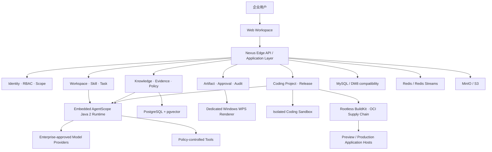

# GW Nexus Edge

[](LICENSE)

> 基于 AgentScope Java 2 构建的企业级 Agent Workspace 平台。

## 许可与边界（ADR-0010）

- 本项目源代码采用 **Apache License 2.0** 开源（见 [LICENSE](LICENSE)）。
- **当前处于 V1 Enterprise Pilot 开发阶段，不代表生产可用**；未通过生产门禁的能力在文档中标记
  `Pending` / `Partial` / `Blocked`。
- **商标、Logo、客户数据、企业模板与第三方组件不因 Apache-2.0 自动授权**；第三方依赖各自许可证见
  [THIRD-PARTY-NOTICES.md](THIRD-PARTY-NOTICES.md)。
- **安全漏洞请通过私密渠道报告**（[SECURITY.md](SECURITY.md)，Private Vulnerability Reporting），
  **不要公开创建安全 Issue**。

GW Nexus Edge 面向企业私有化部署，为企业提供安全、可治理、可审计的 AI Agent 工作空间。平台将企业身份、业务资料、知识检索、Agent 执行、可信证据、成果审批与应用交付组织在统一 Workspace 中，使 Agent 不只回答问题，还能在明确的权限和责任边界内完成真实业务任务。

项目目前处于 **V1 Enterprise Pilot 开发阶段**，目标是建立可运行、可维护、可扩展的企业生产系统，而不是展示性质的 AI Demo。尚未通过生产门禁的能力会在仓库文档中明确标记为 `Pending`、`Partial` 或 `Blocked`。

## V1 产品目标

V1 包含两条相互独立、均为 P0 的生产闭环。

### 企业经营分析 Workspace

将企业业务资料转化为可审核、可追溯、可编辑的正式成果：

```text
企业资料与 Office 模板
        ↓
Managed Workspace / Knowledge / Evidence
        ↓
AgentScope Business Analysis Agent
        ↓
Word / PowerPoint / Excel Artifact
        ↓
业务负责人审核 → 领导批准 → 正式发布
```

关键目标包括：

- 支持 `.docx`、`.xlsx`、`.pptx` 和具有文本层的 `.pdf`；
- 所有关键数字、公式和业务事实均可追溯到权威文件版本与 Knowledge Snapshot；
- 证据不足、数据冲突和分析推断必须明确标识，禁止 Agent 创造业务事实；
- 使用企业模板生成可编辑的 Word、PowerPoint 和 Excel 成果；
- 通过业务审核与最终批准两个人工责任节点进入正式发布。

### Coding Workspace

让 Coding Agent 在受控环境中完成前端与 Node.js SSR 应用的修改、验证、预览和部署：

```text
新建项目 / 导入标准 Git Repository
        ↓
Coding Plan 与人工确认
        ↓
隔离 Sandbox 中修改、测试和开发构建
        ↓
Diff / Commit / Push / Preview
        ↓
供应链安全门禁与 Release Candidate
        ↓
人工 Production 发布 → HTTPS 域名
```

V1 不建设在线 IDE 或通用 PaaS。所有不可信代码执行必须位于隔离 Sandbox；Production 发布必须绑定不可变 Commit、Artifact 和 Image Digest，并经过人工明确批准与不可绕过的安全检查。

## 产品与 Runtime 边界

GW Nexus Edge **不是另一套 Agent Runtime**。

- **AgentScope Java 2.0.1** 是唯一 Agent Runtime，负责 Agent、Workflow、Memory、Tool Calling、模型 Provider、运行事件和执行恢复。
- **GW Nexus Edge** 负责企业 Tenant、身份、Workspace、Skill、Knowledge、Permission、Policy、Task、Artifact、Approval、Audit 和 Web 用户体验。

平台禁止重复实现 AgentScope 已提供的 Agent 循环、Workflow Engine、Memory Runtime、Tool Framework 或模型协议层。

## 总体架构



## V1 技术基线

| 领域 | 技术基线 |
|---|---|
| Backend | Java 21、Spring Boot 4.1.0 |
| Agent Runtime | AgentScope Java 2.0.1 Harness/Core，内嵌模式 |
| Persistence | MyBatis-Plus、MySQL；DM8 兼容认证 |
| Knowledge | PostgreSQL + pgvector |
| Cache / Event | Redis + Redis Streams、Transactional Outbox |
| Object Storage | MinIO / S3 Provider |
| Web | React 19、TypeScript、Vite、Tailwind CSS、shadcn/ui |
| Agent UI | assistant-ui，经 `@gwnexus/assistant-ui` 治理层接入 |
| API | `/api/v1` REST、SSE、`Last-Event-ID`、OpenAPI |
| Observability | OpenTelemetry、Prometheus、Grafana、Loki |
| Deployment | Ubuntu Server 24.04 LTS、Docker Compose |
| CI/CD | GitHub Actions |

Windows Desktop 已进入 V1.1，不属于 V1 开发和验收范围。V1 的两条 P0 闭环必须仅通过 Web 完成。Windows Renderer 是独立的服务端 Artifact 基础设施节点，不是 Desktop 客户端。

## 核心工程原则

- **长期架构优先**：不接受只为当前可运行、未来必须推倒重写的临时方案。
- **真实闭环优先**：禁止 Mock 数据、固定业务结果、占位实现和隐藏的未完成逻辑。
- **安全默认拒绝**：权限、数据外发、Secret、Sandbox 和 Production Gate 在服务端强制执行。
- **证据优先**：事实、推断和观点必须分开；测试结论必须能够复现。
- **版本化治理**：Skill、Prompt、Workflow、Policy、Template、Schema 和公共契约均可追溯。
- **组件复用优先**：Web 优先使用 `@gwnexus/ui`、shadcn/ui 和 `@gwnexus/assistant-ui`，未经批准不得重复实现已有基础组件。
- **AI Agent 可替换**：Codex、Claude、Gemini 等开发 Agent 必须共享同一套 Git、Blueprint、ADR、测试和 Handoff 事实来源。

## 仓库结构

```text
gw-nexus-edge/
├── backend/                  Java / Spring Boot / AgentScope 工程
├── docs/
│   ├── blueprint/            产品与架构唯一正式规格
│   ├── adr/                  Architecture Decision Records
│   ├── governance/           Open Questions 与治理记录
│   ├── handoffs/             跨开发者与 AI Agent 交接记录
│   └── archive/legacy/       仅供追溯，禁止作为实现依据
├── AGENTS.md                 AI 与工程开发宪章
└── AI_START_HERE.md          跨 AI Agent 统一接管入口
```

Web、部署与基础设施模块将在对应工作项通过设计和准入门禁后加入 Monorepo。README 不以尚未建立的目录冒充已完成实现。

## 开始阅读

任何开发者或 AI Agent 在修改代码前必须依次阅读：

1. [`AGENTS.md`](AGENTS.md)
2. [`AI_START_HERE.md`](AI_START_HERE.md)
3. [`docs/README.md`](docs/README.md)
4. [`docs/blueprint/00_DECISIONS.md`](docs/blueprint/00_DECISIONS.md)
5. [`docs/blueprint/17_IMPLEMENTATION_READINESS_CHECKLIST.md`](docs/blueprint/17_IMPLEMENTATION_READINESS_CHECKLIST.md)
6. [`docs/governance/OPEN_QUESTIONS.md`](docs/governance/OPEN_QUESTIONS.md)
7. 当前工作项的 Blueprint、ADR 与 Handoff

`docs/archive/legacy/` 中的内容不具备实现权威性。

## 当前开发状态

当前阶段是 **Phase 0：兼容性与工程基座**。

- Java 21 + Spring Boot 4.1.0 + AgentScope Java 2.0.1 核心组合已完成兼容性验证；
- MySQL、PostgreSQL、Redis、Sa-Token、MyBatis-Plus 和 Flyway 的外围组合已完成当前环境验证；
- AgentScope Persistence/Recovery 生产边界仍在验证；
- DM8 企业环境兼容认证、WPS Renderer、真实模型 Provider、Coding Sandbox、供应链与 Application Host 仍受各自门禁约束；
- 项目尚未达到 Enterprise Pilot 或生产可用状态。

权威进度以 [`实施准入与完成清单`](docs/blueprint/17_IMPLEMENTATION_READINESS_CHECKLIST.md) 和当前 [`Handoff`](docs/handoffs/README.md) 为准，不以 README、Issue 描述或聊天记录替代正式证据。

## 本地验证

当前已建立的后端模块可通过 Maven Wrapper 验证：

```bash
cd backend
./mvnw clean verify
```

要求使用 Java 21。部分集成测试需要可用的 Docker 环境；DM8、真实模型 Provider 和其他外部系统测试还需要通过 Secret Provider 安全注入的合法环境与凭证。

## 贡献与协作

当前仓库处于早期产品开发阶段。提交变更前必须遵循：

- 一次只完成一个边界清晰的 Work Item；
- 架构、安全、公共契约或 V1 范围变化先提交 ADR；
- 不得静默降低 Java、Spring Boot 或 AgentScope 固定版本；
- 不得将未验证能力表述为已支持或生产可用；
- 合并前更新对应 Handoff，并记录基线 Commit、变更、测试、风险和下一步；
- 禁止提交 API Key、密码、Token、证书私钥、企业数据或其他 Secret。

详细要求见 [`AGENTS.md`](AGENTS.md) 和 [`AI Agent 协作规范`](docs/blueprint/18_AI_AGENT_COLLABORATION.md)。

## 仓库可见性与许可

本仓库可以公开访问，但**公开可见不等于获得开源许可**。在项目正式发布许可证前，除适用法律和代码托管平台条款明确允许的范围外，未授予复制、修改、分发或商业使用 GW Nexus Edge 专有代码的许可。

第三方开源组件仍分别适用其原始许可证；相关 `LICENSE`、`NOTICE`、SBOM 和第三方许可清单将按照项目供应链治理流程维护。

正式开源许可证或 Source Available 许可模式必须通过 Architecture Decision Record 确认，不能仅通过公开仓库可见性推断。

## 安全问题

请不要在公开 Issue、Discussion、日志或截图中披露漏洞细节、企业数据或 Secret。安全报告流程将在 `SECURITY.md` 中正式发布；在该流程建立前，请通过仓库所有者提供的私密渠道报告问题。

---

**GW Nexus Edge：让 Agent 在企业边界内完成可验证、可审核、可交付的真实工作。**
