# 19 — GW Nexus Edge V1 产品需求图集

> 状态：Accepted  
> 适用范围：产品评审、交互设计、研发拆分、测试设计和 Enterprise Pilot 验收  
> 说明：本图集是正式需求的可视化投影，不替代文字规格；若图与 Blueprint 文字冲突，必须停止并修正规范，不能选择更方便的一方实现

## 1. 图集用途与维护规则

本图集回答产品设计阶段的十一类问题：

| 图号 | 需要回答的问题 | 主要使用者 |
|---|---|---|
| PRD-D01 | 谁使用产品，各自承担什么责任？ | 产品、权限、测试 |
| PRD-D02 | V1 用户能完成哪些核心用例？ | 产品、研发、验收 |
| PRD-D03 | 经营分析任务的完整用户旅程是什么？ | 产品、UX、业务验收 |
| PRD-D04 | 用户动作、平台服务和后台能力如何协同？ | 产品、架构、运维 |
| PRD-D05 | V1 Web功能域与V1.1 Desktop边界如何组织？ | UX、Web、Desktop路线图 |
| PRD-D06 | V1.1 Desktop如何在V1 Web契约上接力？ | 产品、客户端、V1.1测试 |
| PRD-D07 | 数据、权限和模型调用边界在哪里？ | 安全、Agent、测试 |
| PRD-D08 | Task、Artifact 与人工审批如何衔接？ | 产品、后端、审批验收 |
| PRD-D09 | V1 做什么、不做什么、以后做什么？ | 产品、项目管理、销售 |
| PRD-D10 | Coding Agent如何从Git安全地产生ChangeSet和Preview？ | 产品、Agent、安全、研发 |
| PRD-D11 | Release Candidate如何经过供应链门禁发布为HTTPS应用？ | 产品、安全、部署、验收 |

维护要求：

- 角色、核心流程、状态机、P0范围或端职责变化时，必须同步更新相关图。
- 图中的节点名称必须使用 `16_GLOSSARY.md` 术语。
- 图只表达用户可验证行为和正式系统边界，不展示模型隐藏思维链。
- Mermaid 源码必须在公开 GitHub 中可渲染；CI 应检查代码围栏和 Mermaid 语法。
- 需求评审必须引用图号，例如“变更影响 PRD-D03、PRD-D06、PRD-D08”。

### 1.1 汇报展示版图片

以下 PNG 用于产品汇报、企业方案和评审展示。正式需求仍以本 Blueprint 的文字与 Mermaid 源码为准；展示图片中的文字或布局若与正式规格冲突，不得反向修改需求迁就图片。v3已按ADR-0004明确标注“V1 Web-only、Desktop V1.1”。

#### 技术架构图（v3）

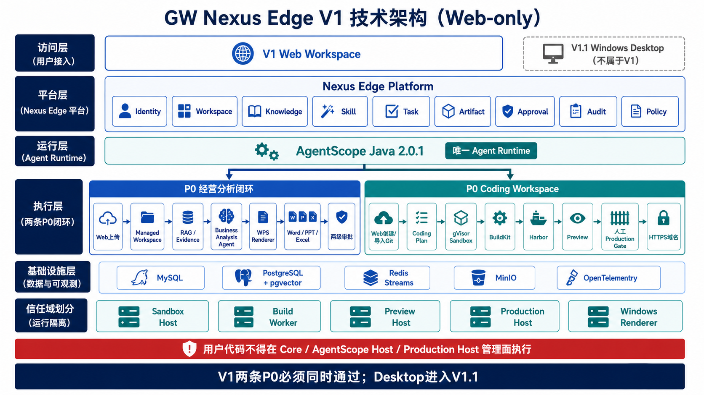

#### 整体需求闭环图（v3）

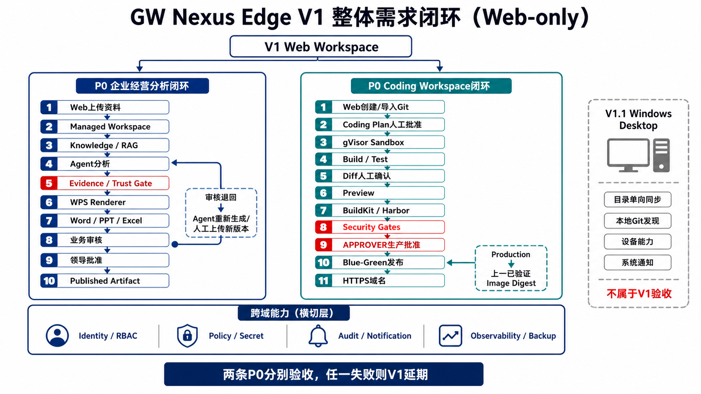

## 2. PRD-D01：用户角色与责任图

这张图用于防止把系统角色、企业职位和组织部门混为一谈。

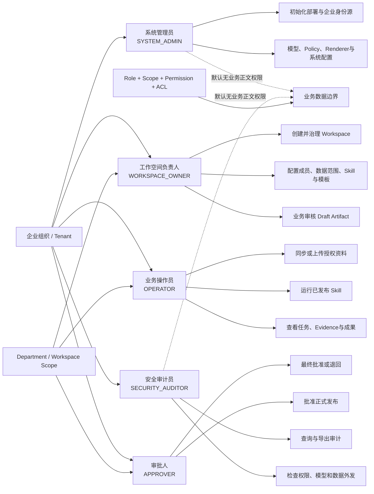

产品约束：企业职位不自动映射为系统权限；同一人员可在不同 Workspace 拥有不同 Role/Scope。

## 3. PRD-D02：V1 核心用例图

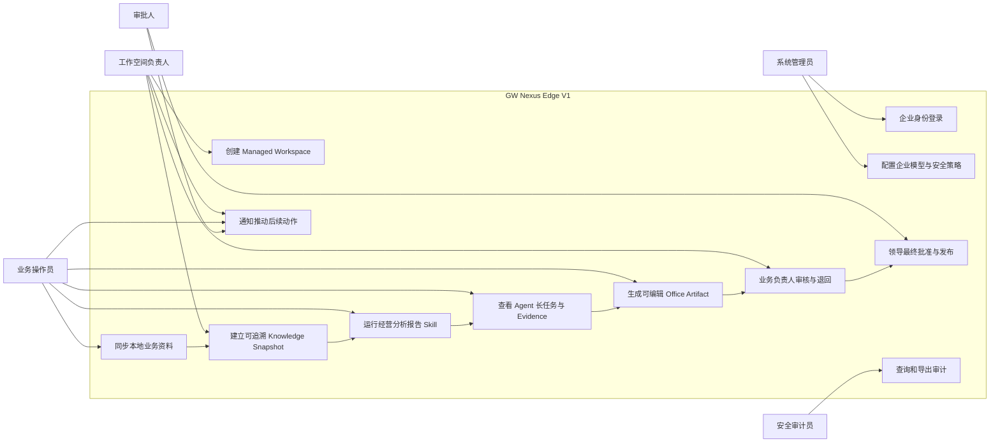

生产承诺只覆盖经营分析报告 Skill。其他四个 Skill 即使出现在演示环境，也不得改变本图的 V1 验收中心。

## 4. PRD-D03：经营分析用户旅程

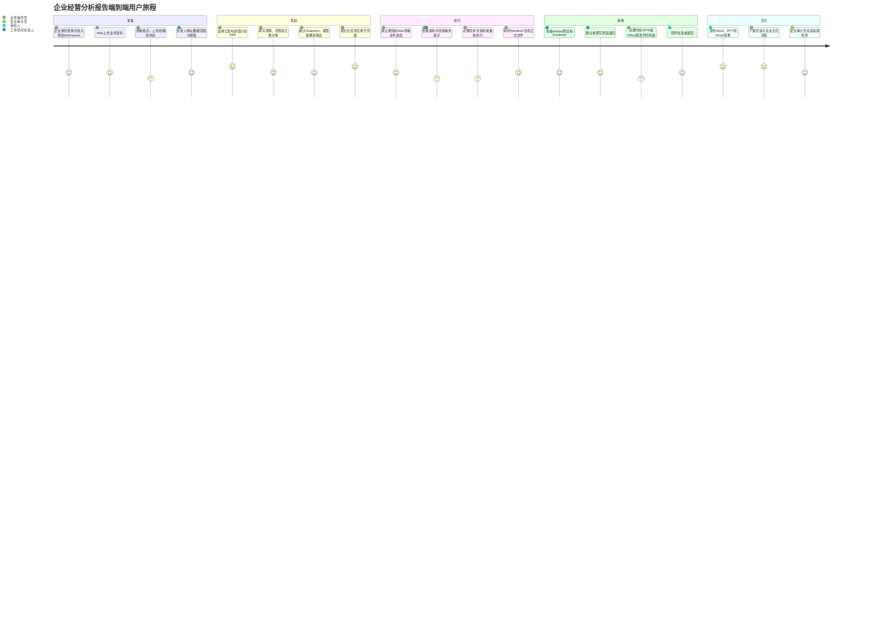

重点体验指标：用户不依赖刷新页面；客户端关闭不影响任务；每次退回都说明原因；正式成果不需要重新制作。

## 5. PRD-D04：经营分析服务蓝图

该图把用户界面和后台能力分开，适合产品、研发、测试和运维共同评审。

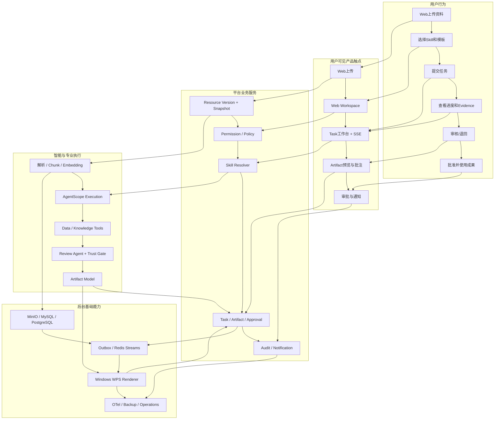

失败体验要求：任何一层失败都必须投影为用户可理解的业务状态、下一步和通知，不能只留下后台日志。

## 6. PRD-D05：产品功能域与信息架构

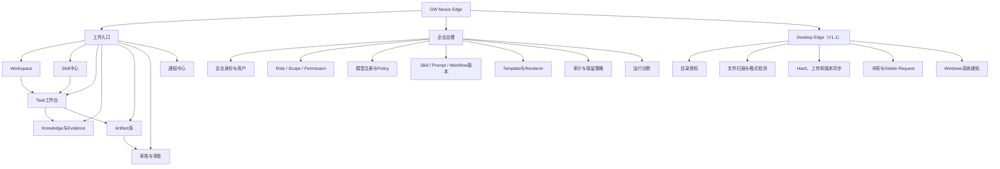

Web 是 V1 唯一工作入口。Desktop Edge 整体进入 V1.1，只能在共享工作能力之上增加本地能力，不建立独立业务模型。本图中的 Desktop 节点是路线图投影，不属于 V1 P0。

## 7. PRD-D06：V1.1 Web/Desktop 跨端接力图

本图仅描述V1.1目标能力，不属于V1验收。V1完整流程在Web中结束，不依赖图中的Desktop步骤。

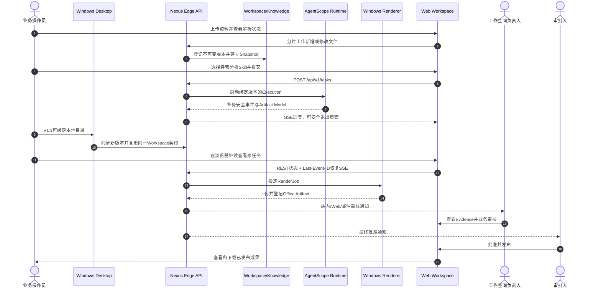

V1 首验可在企业内网完成；DMZ公网和手机接力是部署增强，不改变统一 Workspace、Task 和 Artifact 状态。

## 8. PRD-D07：权限、数据与模型边界图

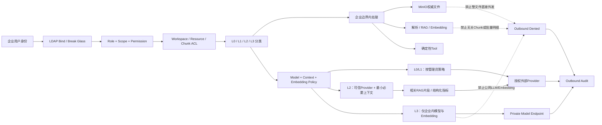

产品必须向用户解释当前任务使用哪个模型、为什么允许或阻止，而不能把安全策略表现为不明原因失败。

## 9. PRD-D08：Task、Artifact 与审批协同图

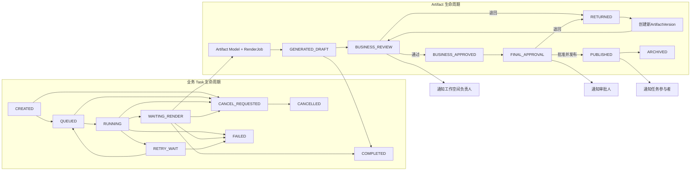

Task 完成只表示执行和正式文件生成完成，不表示成果已经审核或发布。`RESUBMITTED` 是事件，新版本重新进入 BUSINESS_REVIEW。

## 10. PRD-D09：V1 范围与演进图

```mermaid
flowchart LR
    subgraph P0["V1 Enterprise Pilot — P0"]
        P01["单企业Tenant + LDAP/AD + 五角色"]
        P02["Web完整工作入口"]
        P04["Managed Workspace + Snapshot"]
        P05["DOCX/XLSX/PPTX/文本PDF"]
        P06["RAG + Evidence + Trust Gate"]
        P07["经营分析报告Skill"]
        P08["长任务 + SSE + Recovery"]
        P09["WPS Renderer Compatibility Gate"]
        P10["Artifact版本 + 两级审批"]
        P11["通知、审计、备份、平台安装生命周期"]
        P12["Coding Project + Git + Plan/ChangeSet"]
        P13["隔离Sandbox + Code Index + Preview"]
        P14["BuildKit + Harbor + 供应链安全门禁"]
        P15["人工Production + HTTPS域名 + 回滚"]
    end

    subgraph V11["V1.1 — 企业增强"]
        E00["Windows Desktop + Tauri<br/>目录同步/本地Git/系统通知"]
        E01["SMB/NAS Connector"]
        E02["MySQL/DM8只读Connector"]
        E03["Scheduler / 自动月报"]
        E04["WPS企业版 / Microsoft Renderer"]
        E05["OIDC/SAML/MFA与公网移动增强"]
        E06["OCR Provider"]
        E07["自动PR Preview / Push Build / CD"]
        E08["在线编辑器 / Terminal / 多Repo"]
        E09["DNS Provider API"]
    end

    subgraph V2["V2+ — 平台扩展"]
        F01["多企业SaaS与Billing"]
        F02["Kubernetes / HA / 异地灾备"]
        F03["在线Office协同"]
        F04["更多行业Skill和Connector"]
        F05["Cloud Demo产品化"]
    end

    P0 -->|"P0全部通过后"| V11
    V11 -->|"商业与规模验证后"| V2
```

明确不允许把 V1.1/V2 能力提前塞入 V1，然后以 Mock、隐藏开关或未验收代码声称“架构已经支持”。长期扩展通过稳定领域边界、SPI、契约和版本治理实现，而不是预先实现全部功能。

## 11. PRD-D10：Coding Agent安全执行闭环

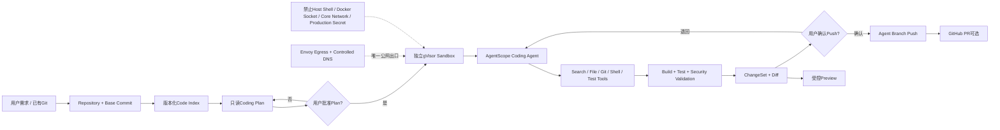

## 12. PRD-D11：Coding Application供应链与发布闭环

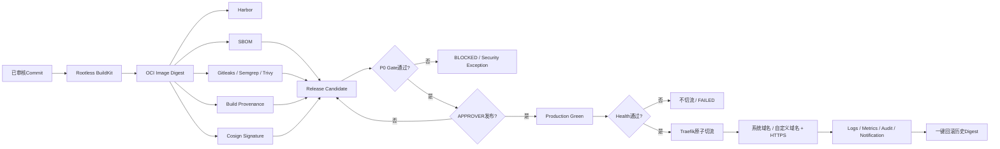

## 13. 需求到验收追踪

| 图号 | 主要规格 | 关键验收 |
|---|---|---|
| PRD-D01 | 07 Security、01 PRD | 五角色权限矩阵、越权为0 |
| PRD-D02 | 01 PRD、02 Scope | 核心用例端到端闭环 |
| PRD-D03 | 01 PRD、10 UX | 加工时间降低≥70%、满意度达标 |
| PRD-D04 | 03 Architecture、12 Operations | 每层失败可观察、可恢复、可通知 |
| PRD-D05 | 10 UX、13 Engineering | V1 Web与V1.1 Desktop职责和共享包边界一致 |
| PRD-D06 | 06 API、10 UX | REST+SSE断线恢复、客户端离线任务继续 |
| PRD-D07 | 07 Security、09 Trust | 越权、L3外发、审计缺失均为0 |
| PRD-D08 | 04 State Machines、11 Artifact | Task与Artifact状态不混用、两级审批完整 |
| PRD-D09 | 02 Scope、15 Roadmap | P0无范围漂移，未通过Gate允许延期 |
| PRD-D10 | 21 Coding Workspace、22 Sandbox | Plan/ChangeSet门禁、Sandbox隔离、Git审计 |
| PRD-D11 | 22 Supply Chain、23 Deployment | Digest一致、人工Production、HTTPS、回滚与零安全事故 |

产品、设计、研发和测试评审应共同使用本图集。任何实现若无法在图中找到所属角色、用户价值、系统触点、状态或验收关系，应先判断它是否超出 V1 范围。
